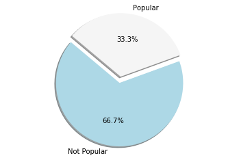
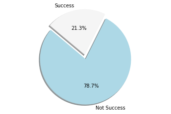

# Predicting a Movie's Success Before Release 
### Team 17: Jefferson Zhan, Tony Zhang, Emily Wang, Jordan Leahey 

* * *

   

### 1) Introduction and Motivation 

#### Preface:
Our team decided to change our dataset from the one in our proposal to a different Kaggle dataset on movie ratings. This was due to the realization that our last dataset was more suited to visualization projects and unsupervised learning.

#### Overview:
Movies are such an important aspect of modern culture. The movie industry brings in billions of dollars annually. Many people will spend their free time watching movies or plan a hangout at the movie theaters, but how many times have you finished watching a movie and realized what a waste of time and money it was, despite being very excited over the premise or actors?

What makes a movie truly successful then? There are movies with budgets in the hundreds of millions but still flop in the box office. Is there a way to use the numbers and data behind each movie to predicts its success beforehand? While a lot of research has been done on predicting movies using user ratings on social media, there's been fewer research done using the actual data behind movies [1]. 

#### Goal:
Be able to predict whether a movie will be successful depending on its budget, runtime, and popularity *. This prediction would help both producers and the audience. Correlations will give directors and writers a rough guideline of past successes, and the audience can use this information to determine if a movie is worth their time and money to watch in theaters.

>*Popularity for each movie is determined by the number of votes, views, favorites, and watchlist adds per day compared the the previous days score as well as the release this. TMDB uses this metric to boost their search results as well as show users what is popular at the time of their visit to the website. Even before a movie is released popularity can be used to show growing interest in the movie as it gets closer to the release date and how the movie has been received after it has been released.

* * * 

### 2) Dataset and Methods 
#### TMDB 5000 Movie Dataset from Kaggle
- https://www.kaggle.com/tmdb/tmdb-movie-metadata 

The Kaggle dataset uses information from TMDB due to copyright concerns from the IMDB website.

This dataset contains two data sources: tmdb_5000_credits and tmdb_5000_movies. 

*tmdb_5000_credits features:*
- movie_id, title, cast, crew

*tmdb_5000_movies features:* 
- budget, genres, homepage, id, keywords, original_language, original_title, overview, popularity, production_companies, production_countries, release_date, revenue, runtime, spoken_languages, status, tagline, title, vote_average, vote_count   

Our team decided to combine these two data sources, so we would have access to all these features. 

   

#### Pairwise Plot 

Since certain features are categorical and others are continuous, our team plotted the pairplot to better visualize relations and determine how to deal with the different types. 

   

* * * 

### 3) Feature Selection and Data Manipulation 

Firstly, data values such as duration or vote_average which were equal to zero were dropped as those are not plausible. 

Our team decided to deem a movie as "successful" using three metrics: 'Popularity Success', 'Vote Success', and 'Commercial Success'.
1. 'Popularity Success':  if a movie's popularity feature is greater than the mean of all popularity scores. 
2. 'Vote Success': likewise if the voting_average of a movie is higher than the mean of all vote averages. 
3. 'Commercial Success': if a movie's gross profit exceeds its budget. 

A movie will be considered *truly successful* if it fits all three of these criterion. The 3 pie graphs below shows a breakdown of the percentage of movies in the dataset that fulfill each success factor. 

Popularity Sucess          |  Vote Success             | Commercial Success
:-------------------------:|:-------------------------:|:------------------:
 |   | 

So out of all the movies in our dataset, only 21.3% are truly successful using our team's definition.

   

In order to further determine what features play an important role, we graphed a few visualizations to determine if there was an important relationship between the feature and successful v.s. unsuccessful movies. 

Budget x True Success      |Title_month x True Success | Duration x True Success
:-------------------------:|:-------------------------:|:------------------:
 |   | 

#### Preprocessing and Method Selection: 

Our team decided to use a binary classification system, where we chose threshold values for certain columns of the data, and for each movie, we set that column to either a 1 or a 0. This allows for the use of certain algorithms to determine whether or not a movie would be successful. 

For example, for the budget, we added seven new columns as classifiers to cover the possible range. So if a movie's budget is less than $5,000,000, then it is considered 'extremelylow' budget and would have a 1 in the column. If a movie's budget is great than $150,000,000, then it is considered as 'blockbusterhigh'. A similar process was followed for converting the 'title_month' and 'duration' of each movie. For the genre, the dataset provided this information as text, so a movie could be Crime, Thriller, Horror. We mapped each genre into a column, and a movie would have a corresponding 1 in that column if its classified under it. 

After looking at our correlation map between different features and each success, we chose to drop numerous features that did not have a strong correlation with the success of a movie such as'homepage' and 'vote_count'. There were also features such as actor names, directors, languages and more that we chose not to convert to binary and thus also dropped them. Our final modified dataset consisted of 4716 rows and 35 columns. 

* * *  

### 4) Supervised Learning Models 

To train our models, we split our data randomly so that 75% is used as training and 25% as predictions. 

#### Decision Tree - Cross Validation Score  

**PUT IN SOME DESCRIPTION HERE***

Cross validation accuracy: 69% 

Accuracy: 74%

   

Depth = 7 

Accuracy = 79.5%

 

Depth = 3 

Accuracy = 78%

 

#### Random Forest Tree Model

**PUT IN SOME DESCRIPTION HERE**

   

Depth = 7 

Cross validation = 75%

Accuracy = 79%

#### K-nearest neighbors

**SOME DESCRIPTION HERE** 

Using 100 neighbors 

Cross validation accuracy: 78%

Accuracy: 79%

   

#### SVM 

**SOME DESCRIPTION HERE**

Cross validation accuracy: 76%

Accuracy: 79% 

   

OTHER STUFF TO CONSIDER: PUT IN POSSIBLE REASONINGS FOR WHY SOME METHODS WORK BETTER ETC ETC

* * * 

### 5) Conclusion 

#### Room for Improvement
Our team could have used a regression model to generate a “likelihood” score of whether or not a movie would be successful. Since this would generate a percentage on a scale from 1-100, the result would be a lot more specific than a binary classification.In terms of classification, we could have also implemented a non-binary gradient scale of success such as “slightly successful” or “very successful” which would also improve specificity. 

Furthermore, due to how many aspects there are to movies, there is huge potential for additional exploration. Our team focused on the more numerical features such as budget  or voting average. However, we could test many more of the different attributes to see how they contribute to a movie’s success, such as the actors involved, who directed it, who produced it, key words, and so on.

This would potentially modify the definition of success in the future. By using different weights and linear combinations in the success features, there might be different results and potentially more accurate predictions.

### References 

[1] Latif, Muhammad Hassan, and Hammad Afzal. "Prediction of movies popularity using machine learning techniques." International Journal of Computer Science and Network Security (IJCSNS) 16, no. 8 (2016): 127.

[2] Caruana, Rich, and Alexandru Niculescu-Mizil. “An Empirical Comparison of Supervised Learning Algorithms.” ACM Digital Library, ACM, 2006. dl.acm.org/citation.cfm?id=1143865.

[3] Cutler A., Cutler D.R., Stevens J.R. (2012) Random Forests. In: Zhang C., Ma Y. (eds) Ensemble Machine Learning. Springer, Boston, MA
